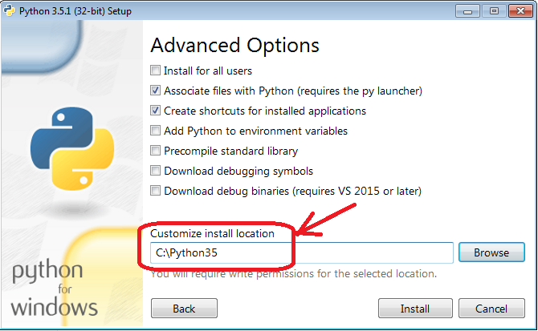

## Установка интерпретатора Python и среды разработки Wing IDE

1.  ### Установка интерпретатора Python
    
    **Windows**  
    Скачайте инсталлятор по этой  [ссылке](https://anosoff.com/files/py/python-3.5.1.exe).  
    Запустите инсталлятор.  
      
    **Mac OS**  
    Скачайте инсталлятор по этой  [ссылке](https://www.python.org/ftp/python/3.5.1/python-3.5.1-macosx10.6.pkg).  
    Установку необходимо производить в стандартную папку (не на диск C).  
    Для запуска инсталлятора наберите в консоли "python3".  
    Процесс установки аналогичен установке в Windows.  
      
    После запуска инсталлятора в первом окне выберите пункт меню  **Customize installation**.  
      
      
      
    На следующем шаге нажмите  **Next**.  
      
      
      
    На следующем экране изменить путь к программе на: «**C:\Python35**».  
    Нажмите кнопку  **Install**.  
      
      
      
    В последнем окне нажмите кнопку  **Close**.  
      
    Интерпретатор Python 3 успешно установлен!
  
3.  ### Установка Wing IDE
    
    **Windows**  
    Скачайте инсталлятор по этой  [ссылке](https://anosoff.com/files/py/wingide-101-5.1.11-1.exe).  
    Запустите инсталлятор.  
      
    **Mac OS**  
    Скачайте инсталлятор по этой  [ссылке](http://wingware.com/pub/wingide-101/5.1.12/wingide-101-5.1.12-1.dmg).  
    Для установки перетащите файл в папку "Программы".  
      
    
    ----------
    
    **Установка и настройка Wing IDE в Windows**  
      
    При установке Wing IDE рекомендуем согласиться со всеми параметрами установки. Ничего изменять не требуется.  
      
    После установки рекомендуем вывести ярлык Wing IDE на рабочий стол.  
      
    Далее необходимо запустить Wing IDE и произвести настройки параметров.  
      
    При первом запуске необходимо согласиться с лицензионным соглашением, нажав на кнопку  **Accept**:  
      
      
      
      
    **Для того, чтобы при выполнении созданных вами алгоритмов запускался установленный вами Python, необходимо выполнить следующие действия:**
    
      
    -   Нажмите на пункт меню  **Edit -> Configure Python...**  
          
        
      
    -   Произведите настройки так, как показано на рисунке.  
        Выберите вариант  **Custom**  в первых 2-х настройках.  
        Задайте пусть к интерпретатору Python, который вы установили.  
        Нажмите на кнопку  **Insert**. Задайте путь к папке с Python.  
        Примените настройки, нажав на кноку  **OK**.  
          
          
          
        
    
      
    **Для того, чтобы при выполнении ваших алгоритмов вместо русского текста не выводилась абракадабра, необходимо задать кодировку, произведя следующие настройки:**
    
      
    -   Нажмите на пункт меню  **Edit -> Preferences...**  
          
        
      
    -   Перейдите в раздел  **Files**  и задайте кодировку  **utf-8**  как показано на рисунке:  
          
        
      
    -   Перейдите в раздел  **I/O**  и задайте кодировку  **utf-8**:  
          
        
      
    -   Примените настройки, нажав на кнопку  **OK**.
    
      
      
    
    ----------
    
    **Настройка Wing IDE в Mac OS**  
      
    При первом запуске Wing IDE необходимо согласиться с лицензионным соглашением, нажав на кнопку  **Accept**.  
      
    Нажмите на пункт меню  **Edit -> Configure Python...**  
      
    Произведите настройки так, как показано на рисунке.  
    Выберите вариант  **Custom**  в первой настройке.  
    Задайте пусть к интерпретатору Python, который вы установили.  
    Примените настройки, нажав на кноку  **OK**.  
      
      
      
    **Поздравляем, все готово для программирования на Python!**
